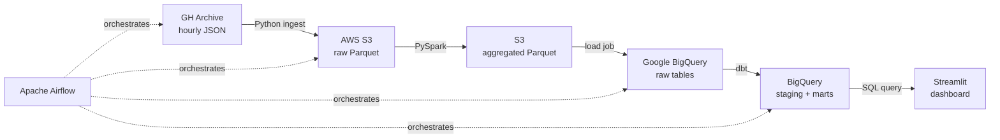

# GH Archive Batch ELT Pipeline

A batch pipeline that ingests public GitHub event data, processes ~3.8M events through a distributed Spark job, models the results in BigQuery with tested transformations, and serves them in an interactive dashboard.

## Architecture



## Overview

[GH Archive](https://www.gharchive.org/) publishes every public GitHub event as hourly JSON files. A single day is roughly 3.8M events of deeply-nested, semi-structured JSON. This pipeline lands that data in S3, aggregates it with Spark down to ~507K distinct repositories and 5 event types, loads the results into BigQuery, applies tested dbt transformations, and visualizes trends like the most-active repositories and event-type distribution. The stack mirrors a production modern data stack: object storage, distributed processing, a columnar warehouse, SQL transformation with data tests, and workflow orchestration.

## Tech Stack

| Layer | Technology |
|-------|-----------|
| Ingestion | Python, boto3 |
| Data lake | AWS S3 (Hive-partitioned Parquet) |
| Distributed processing | Apache Spark (PySpark) |
| Data warehouse | Google BigQuery |
| Transformation | dbt (dbt-bigquery) |
| Orchestration | Apache Airflow (Docker Compose) |
| Dashboard | Streamlit, Plotly |
| Infrastructure | Docker, GitHub Actions |

## Data Flow

1. **Ingest** — A Python script pulls hourly `.json.gz` files from GH Archive and lands them raw in S3, partitioned by `year/month/day/hour` in Hive-style directories.
2. **Process** — A PySpark job reads the raw nested JSON, flattens the fields I care about, filters to 5 meaningful event types, and aggregates. The ~3.8M raw events collapse to ~507K repo rows and a 5-row event-type summary, written back to S3 as Parquet.
3. **Load** — The aggregated Parquet is loaded into BigQuery raw tables.
4. **Transform** — dbt builds staging models over the raw tables and a mart layer for analytics, with `not_null` and `unique` data tests.
5. **Serve** — A Streamlit dashboard queries the dbt marts and renders interactive Plotly charts.
6. **Orchestrate** — An Airflow DAG sequences the four stages (ingest -> process -> load -> dbt) on a daily schedule.

## Key Engineering Decisions

**I used PySpark for processing** because a single day of GH Archive is ~3.8M deeply-nested JSON events. That volume justifies a distributed engine, and it let me demonstrate flattening and aggregating semi-structured data at scale rather than a simple in-memory transform.

**I chose BigQuery as the warehouse** because its sandbox tier stays free indefinitely at this data volume, so the project keeps running as a live portfolio piece at zero cost. I put dbt on top so the transformation logic stays portable if the warehouse ever changes.

**I kept S3 as a data lake layer** — raw and aggregated data land in S3 as Parquet before loading to BigQuery. This is the lake-to-warehouse pattern used in production, and it makes the project genuinely cross-cloud (AWS storage feeding a GCP warehouse).

**I partitioned raw files Hive-style** (`year=/month=/day=/hour=`) so Spark reads the partitions as queryable columns automatically, with no path parsing.

**I added dbt tests** so data issues fail loudly. The models enforce non-null keys and a uniqueness constraint on the event-type dimension.

## Data Quality Notes

GH Archive's raw stream contains a lot of bot activity — a handful of accounts producing 76K-81K empty-commit events per day, far above the ~41K peak of any organic repo. I deferred this cleanup out of Spark and into the dbt mart layer, where business logic belongs: `mart_top_repos` excludes repositories above the anomalous threshold. Fully separating bot from human activity would be its own project; the threshold filter removes the obvious spam while staying explainable.

## Running Locally

### Prerequisites
- Python 3.13 (dbt does not yet support 3.14)
- Docker Desktop (for Airflow)
- An AWS account with an S3 bucket and an IAM user scoped to it
- A GCP project with BigQuery enabled

### Setup
```bash
python3.13 -m venv venv
source venv/bin/activate
pip install -r requirements.txt

# AWS: configure via `aws configure` or a gitignored .env
# GCP: gcloud auth application-default login
```

### Run the stages
```bash
python ingest.py                          # GH Archive -> S3
python process.py                         # PySpark aggregation -> S3
python load.py                            # S3 Parquet -> BigQuery
cd gharchive_dbt && dbt run && dbt test   # transform + test
streamlit run dashboard.py                # dashboard
```

### Orchestration
```bash
cd airflow
docker compose up -d                      # Airflow at localhost:8080
```

## Limitations & Future Work

- **Airflow execution.** The DAG defines and schedules the four stages with correct dependency ordering. Tasks are currently wired as shell commands; running the Spark and dbt steps fully inside the Airflow containers would mean packaging those dependencies and credentials into a custom image — the natural next step.
- **Data scope.** The pipeline processes a single day. Running the DAG on its daily schedule accumulates history over time.
- **S3 read path.** Spark reads from a local copy of the S3 data during development; wiring the `s3a://` connector for direct reads is a follow-up.

---

Built to demonstrate the modern data engineering stack end to end.